# share_meal

A new Flutter project.

## Getting Started

This project is a starting point for a Flutter application.

A few resources to get you started if this is your first Flutter project:

- [Lab: Write your first Flutter app](https://docs.flutter.dev/get-started/codelab)
- [Cookbook: Useful Flutter samples](https://docs.flutter.dev/cookbook)

For help getting started with Flutter development, view the
[online documentation](https://docs.flutter.dev/), which offers tutorials,
samples, guidance on mobile development, and a full API reference.

## Screenshots

Here are some screenshots of the Share Meal app:
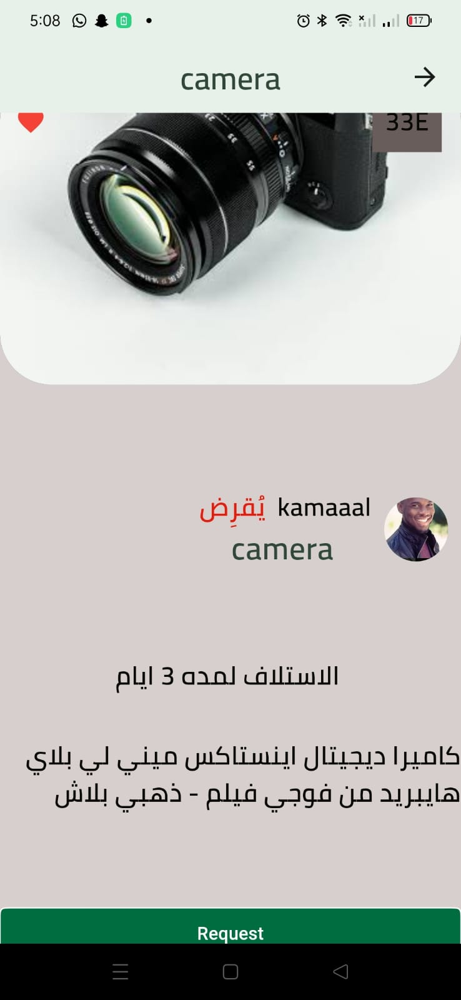

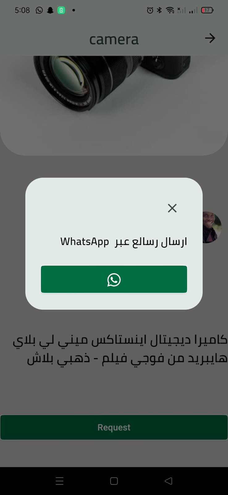
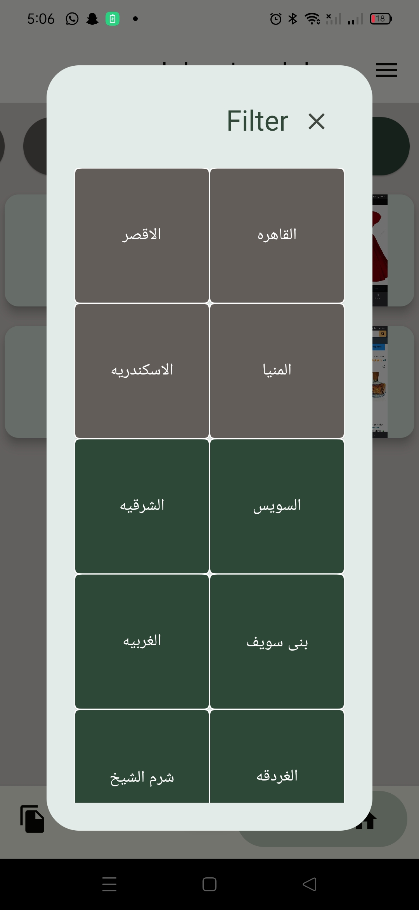
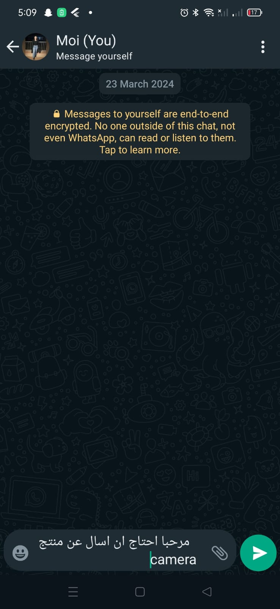
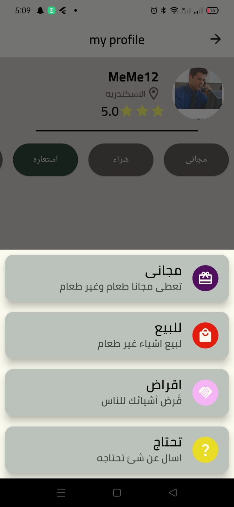
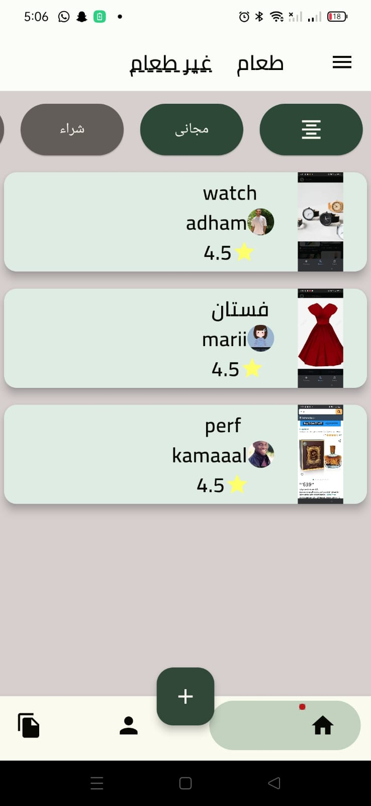
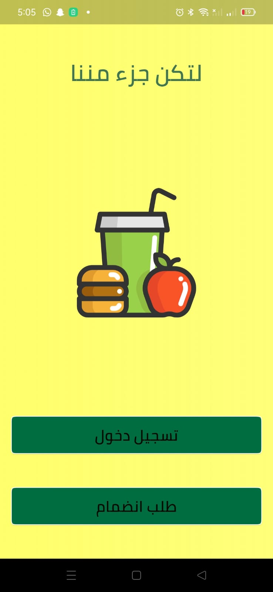
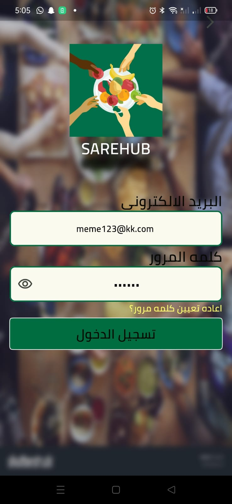
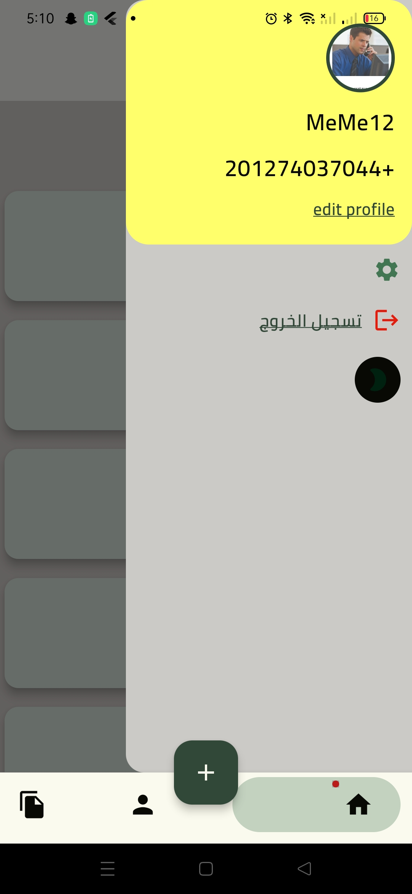
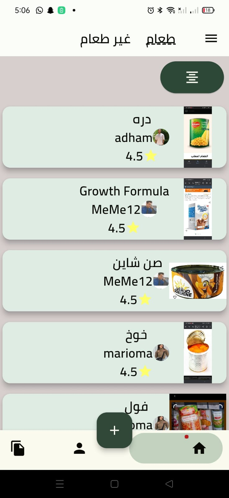
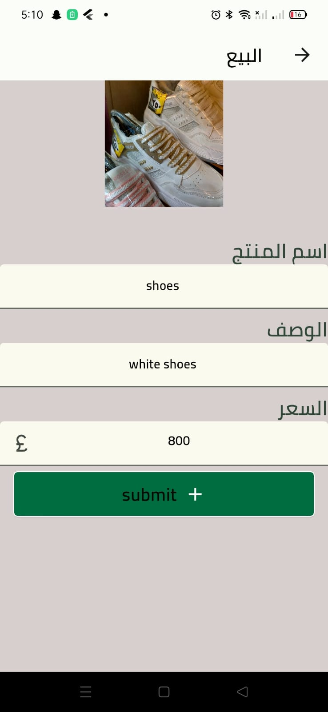

## Features
- ShareHup is a mobile application designed to facilitate the process of sharing, donating, lending, borrowing, selling, and buying goods, add needs and services among users. The main idea behind ShareHup is to create a platform where individuals can connect with each other to fulfill their needs and help others in the community.

## How to Use

To use the Share Meal app:

1. Clone this repository to your local machine.
2. Navigate to the project directory.
3. Run `flutter pub get` to install dependencies.
4. Connect a device or emulator and run `flutter run` to launch the app.

Feel free to contribute to this project by submitting bug reports, feature requests, or pull requests.

